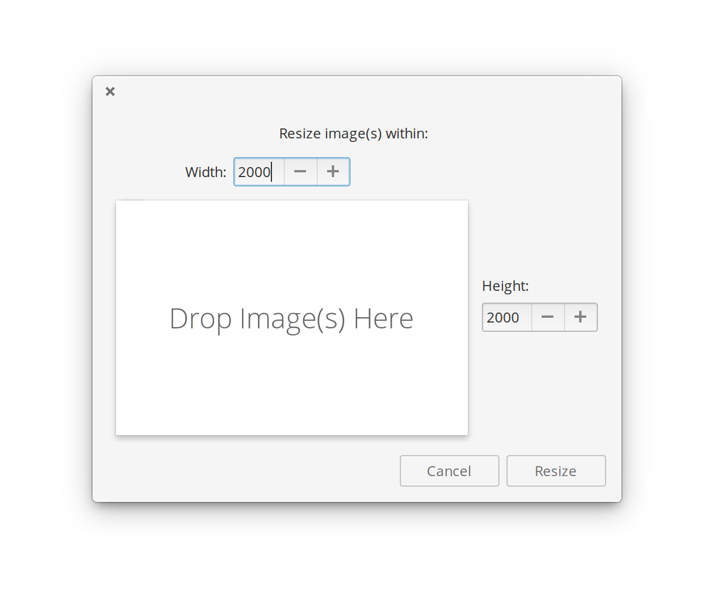
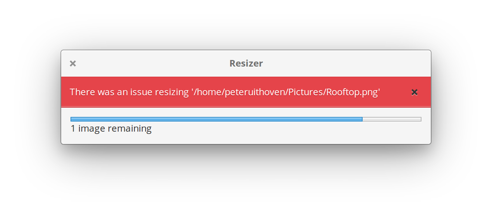

# Resizer

    

Quickly resize images.
Features:
- Open images with Resizer or open Reizer and Drag and drop images
- Maintains aspect ratio.
- Keyboard control: Change the sizes using the up and down keys, press enter to resize.
- Settings are stored for next time.

## Building, Testing, and Installation

You'll need the following dependencies:

* meson >= 0.47.0
* libgranite-dev
* valac

Run `meson` to configure the build environment and then `ninja` to build and run automated tests

    meson build --prefix=/usr
    cd build
    ninja

To install, use `ninja install`, then execute with `com.github.peteruithoven.resizer`

    sudo ninja install
    com.github.peteruithoven.resizer

## translations
Generate `.pot` file using `po/LINGUAS` and `po/POTFILES`:

    ninja com.github.peteruithoven.resizer-pot

Generate / update `.po` files:

    ninja com.github.peteruithoven.resizer-update-po

## Credits

A lot of the code is inspired by the [elementary Screenshot tool](https://github.com/elementary/screenshot-tool) and Felipe Escoto's  [wallpaperize](https://github.com/Philip-Scott/wallpaperize).
The icon is based on the [elementary Photos icon](https://github.com/elementary/icons/blob/master/apps/128/multimedia-photo-manager.svgs) and was greatly improved by [TraumaD](https://github.com/TraumaD).
