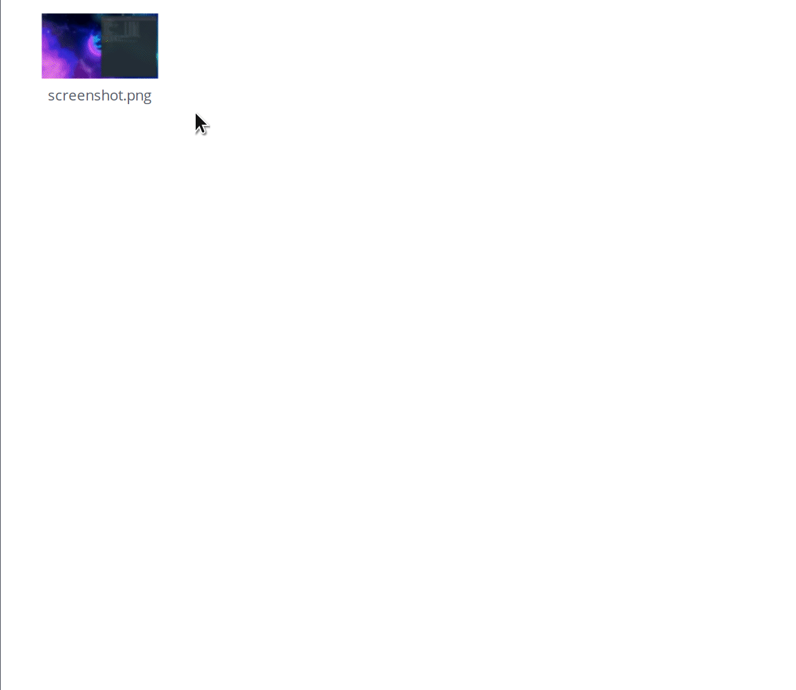
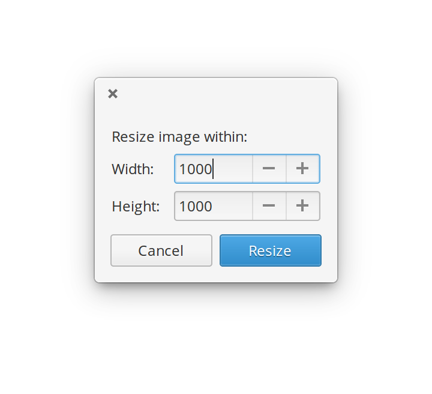

# Resizer

Quick image resize, accessible image's context menu.

## Building, Testing, and Installation

You'll need the following dependencies:

* meson >= 0.43.0
* libgranite-dev
* valac

Run `meson` to configure the build environment and then `ninja` to build and run automated tests

    meson build --prefix=/usr
    cd build
    ninja

To install, use `ninja install`, then execute with `com.github.peteruithoven.resizer`

    sudo ninja install
    com.github.peteruithoven.resizer
