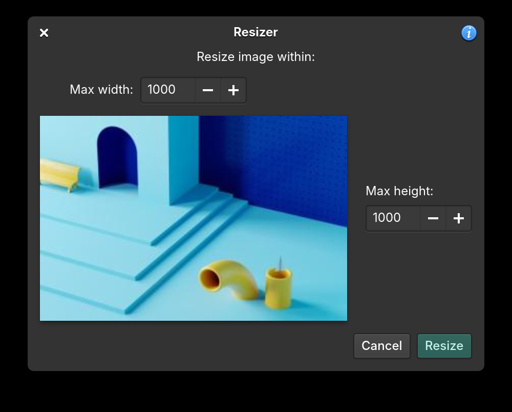
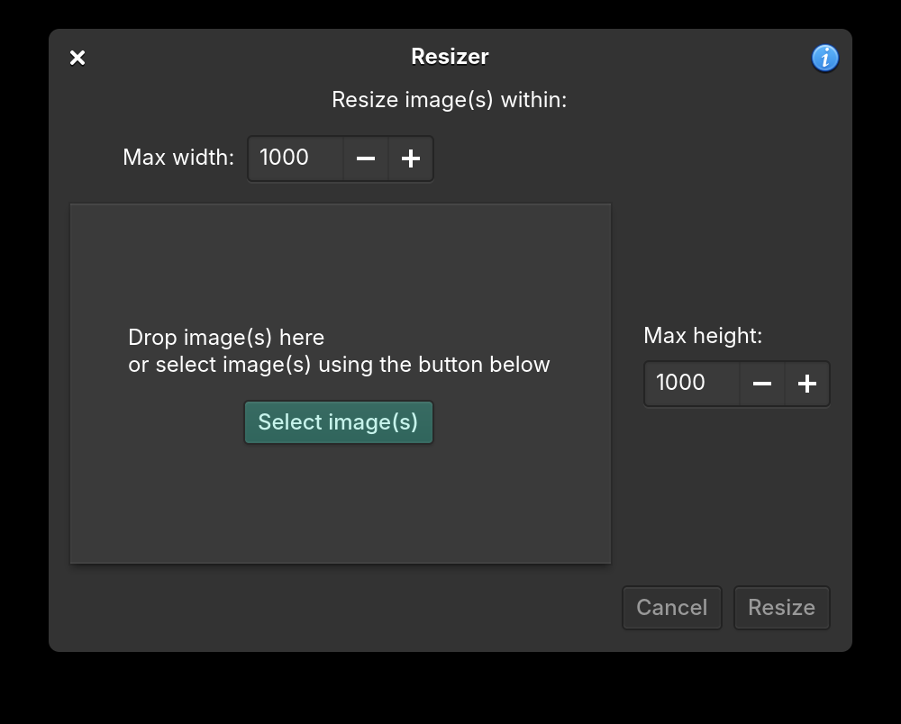
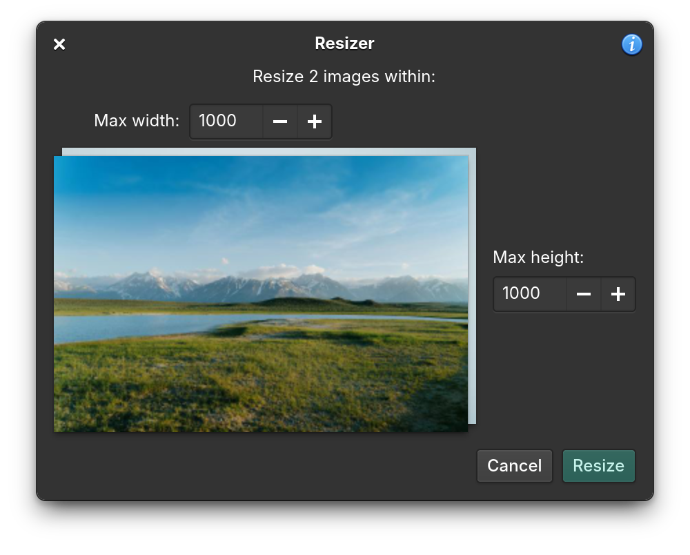

# Resizer

    

Quickly resize images.
Features:

- Open images with Resizer or open Resizer and Drag and drop images
- Maintains aspect ratio.
- Keyboard control: Change the sizes using the up and down keys, press enter to resize.
- Settings are stored for next time.

## Building, Testing, and Installation

You'll need the following dependencies:

- meson >= 0.47.0
- libgtk-4-dev (>= 4.14)
- libadwaita-1-dev (>= 1.5)
- valac

Run `meson` to configure the build environment and then `ninja` to build

    meson setup build --prefix=/usr
    cd build
    ninja

To install, use `ninja install`, then execute with `io.github.peteruithoven.resizer`

    sudo ninja install
    io.github.peteruithoven.resizer

### Running without installing

To try out changes without `sudo ninja install`, `scripts/run.sh` builds the app into
`_build/meson-native` and runs it straight from there:

    ./scripts/run.sh
    ./scripts/run.sh photo.png   # opens a file directly, skipping drag-and-drop

Handy when working in a git worktree, since each one gets its own isolated build.

### Tests

Unit tests cover the resize/naming logic in `src/ImageGeometry.vala` and run via meson:

    meson test -C build

There's also a headless smoke test that launches the installed app and checks it
renders a real image, useful for catching packaging/dependency regressions. It
needs `xvfb`, `xdotool`, and ImageMagick:

    sudo apt install xvfb xdotool imagemagick
    xvfb-run -a ./scripts/smoke-test.sh

## Translations

There are two separate translation domains, each with its own `.pot` template,
`LINGUAS` (list of languages), and `POTFILES` (list of source files to scan):

- `po/` — UI strings, extracted from the `.vala` files listed in `po/POTFILES`.
- `po/extra/` — the app name/description/changelog shown in AppCenter, extracted
  from `data/*.desktop.in` and `data/*.metainfo.xml.in`.

After changing a translatable string (or adding a new `.vala` file that uses
`_()`/`ngettext()` — remember to add it to `po/POTFILES` first, otherwise its
strings are silently never extracted), regenerate the templates:

    meson setup build
    ninja -C build io.github.peteruithoven.resizer-pot extra-pot

then update the existing `.po` files against the new template (this preserves
existing translations, using fuzzy-matching to flag ones that need a translator
to double check them):

    ninja -C build io.github.peteruithoven.resizer-update-po extra-update-po

CI's `translations` job re-runs the `-pot` targets and fails the check (or, on
a direct push to `main`, auto-commits the regenerated templates) if that would
have produced a different result than what's committed — so the templates
should never go stale the way they did before. It does *not* enforce
`-update-po`/translation completeness; run that yourself when you want fuzzy
matches to review. The same job also posts a per-language translated/fuzzy/
untranslated count to the build summary (backed by `msgfmt --statistics`).

### Adding a new language

1. Add the language code to `po/LINGUAS` and, if the app name/description
   should be translated in AppCenter too, `po/extra/LINGUAS`.
2. Generate the `.po` file(s) from the template:

       msginit --locale=<code> -i po/io.github.peteruithoven.resizer.pot -o po/<code>.po
       msginit --locale=<code> -i po/extra/extra.pot -o po/extra/<code>.po

3. Translate the `msgstr` entries. **Leave `msgid "Resizer"` translated as
   `"Resizer"`** — it's the app name, not a description, and should stay the
   same in every language (see `HeaderBar.vala`'s "Resizer will never
   upscale..." string too, which also contains the name inline).
4. Check for syntax errors and see how complete the translation is:

       msgfmt --check --statistics po/<code>.po -o /dev/null

## Credits

A lot of the code is inspired by the [elementary Screenshot tool](https://github.com/elementary/screenshot-tool) and Felipe Escoto's [wallpaperize](https://github.com/Philip-Scott/wallpaperize).
The icon is based on the [elementary Photos icon](https://github.com/elementary/icons/blob/master/apps/128/multimedia-photo-manager.svgs) and was greatly improved by [TraumaD](https://github.com/TraumaD).
